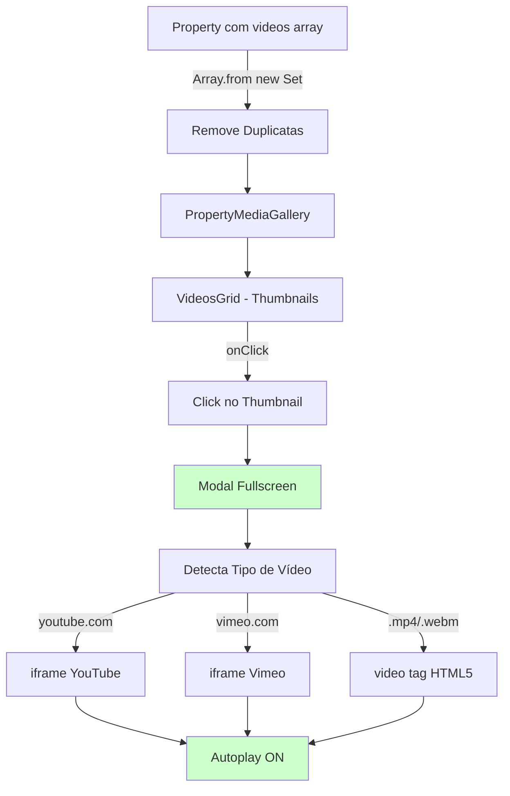

# 🎬 Player de Vídeo Premium - Fullscreen Modal

## ✅ Problemas Corrigidos

### **1. Vídeos Duplicados**
**Antes:** Apareciam 3 vídeos iguais  
**Depois:** Remove duplicatas automaticamente com `Array.from(new Set())`

### **2. Links Quebrados**
**Antes:** Clicava e abria nova aba vazia  
**Depois:** Modal fullscreen com player embutido

### **3. Player Básico**
**Antes:** Link simples, sem customização  
**Depois:** Modal premium com animações e controles personalizados

---

## 🎨 Design Premium

### **Thumbnails com Play Button:**
```
┌─────────────────────────────────┐
│  [Imagem de capa]                │
│                                  │
│       ╔════════╗                │
│       ║  ►     ║  ← Pulse ring  │
│       ╚════════╝                │
│                                  │
│  [VÍDEO]  ← Badge           │
│                                  │
│  Vídeo 1 - Hyde             │
└─────────────────────────────────┘
```

### **Características Visuais:**
- ✅ Play button com **pulse animation** (anel animado)
- ✅ Botão **grande** (20x20, 80px) e **premium**
- ✅ Gradient overlay **elegante** (preto suave)
- ✅ Badge "VÍDEO" no canto superior direito
- ✅ Hover: **Escala 110%** + **Fundo mais claro**
- ✅ Shadow **2xl** no botão play

---

## 🎥 Modal Fullscreen

### **Layout:**
```
╔════════════════════════════════════════╗
║  [Título do Vídeo]             [X]    ║
║                                        ║
║  ┌────────────────────────────────┐   ║
║  │                                │   ║
║  │     PLAYER DE VÍDEO            │   ║
║  │     (YouTube/Vimeo/Direct)     │   ║
║  │                                │   ║
║  └────────────────────────────────┘   ║
║                                        ║
║       [● ━━━ ○ ○]  ← Navegação       ║
╚════════════════════════════════════════╝
```

### **Funcionalidades:**
- ✅ **Background:** Preto 95% com blur
- ✅ **Player:** Centralized, max-width 7xl, aspect-ratio 16:9
- ✅ **Botão X:** Canto superior direito, com rotação no hover
- ✅ **Navegação:** Dots na parte inferior (se múltiplos vídeos)
- ✅ **Click fora:** Fecha o modal
- ✅ **ESC:** Fecha o modal (AnimatePresence)

---

## 🔧 Detecção Automática de Tipo

### **Suporte:**
| Plataforma | Detecção | Embed URL |
|------------|----------|-----------|
| **YouTube** | Regex `/youtube\.com/` ou `/youtu\.be/` | `https://www.youtube.com/embed/{ID}?autoplay=1` |
| **Vimeo** | Regex `/vimeo\.com/` | `https://player.vimeo.com/video/{ID}?autoplay=1` |
| **Arquivo Direto** | `.mp4`, `.webm`, `.ogg` | `<video src={url} controls />` |

### **Função:**
```typescript
const getVideoEmbedUrl = (url: string) => {
  // YouTube
  if (url.includes('youtube.com') || url.includes('youtu.be')) {
    const id = extractYouTubeId(url);
    return {
      embedUrl: `https://www.youtube.com/embed/${id}?autoplay=1`,
      type: 'youtube'
    };
  }
  
  // Vimeo
  if (url.includes('vimeo.com')) {
    const id = extractVimeoId(url);
    return {
      embedUrl: `https://player.vimeo.com/video/${id}?autoplay=1`,
      type: 'vimeo'
    };
  }
  
  // Arquivo direto
  return {
    embedUrl: url,
    type: 'direct'
  };
};
```

---

## 🎯 Animações

### **1. Pulse Ring (Play Button):**
```css
/* Anel animado ao redor do botão */
.animate-ping {
  animation: ping 1.5s cubic-bezier(0, 0, 0.2, 1) infinite;
}
```

### **2. Hover no Play:**
```css
/* Escala + Fundo mais branco */
group-hover:scale-110
group-hover:bg-white
```

### **3. Modal Fade:**
```typescript
<motion.div
  initial={{ opacity: 0 }}
  animate={{ opacity: 1 }}
  exit={{ opacity: 0 }}
  transition={{ duration: 0.3 }}
/>
```

### **4. Botão X Rotação:**
```css
group-hover:rotate-90
transition-transform duration-300
```

---

## 📱 Responsividade

### **Desktop:**
- Player: Max-width 7xl (1280px)
- Título: Texto XL
- Padding: 4 (1rem)

### **Mobile:**
- Player: Full width com padding 4
- Título: Texto LG
- Botão X: Menor (w-12 h-12)
- Navegação: Dots menores

---

## 🧪 Teste Agora!

### **Passo 1: Acesse um imóvel com vídeos**
```
http://localhost:3700/imoveis/PH1113
```

### **Passo 2: Clique em "Vídeos (X)"**
- Deve mostrar thumbnails com play button animado

### **Passo 3: Clique em qualquer vídeo**
- Modal fullscreen abre
- Vídeo começa a tocar automaticamente
- Pode fechar com X ou clicando fora

---

## 🔍 Troubleshooting

### **Vídeo não carrega:**
1. **Verifique a URL:** Console.log do `embedUrl`
2. **Tipo detectado:** YouTube, Vimeo ou Direct?
3. **CORS:** Alguns vídeos diretos podem ter CORS bloqueado
4. **Embed desabilitado:** Alguns vídeos do YouTube não permitem embed

### **Vídeos duplicados:**
✅ Resolvido! `Array.from(new Set(urls))` remove duplicatas

### **Modal não fecha:**
✅ Clique no X, clique fora do player, ou pressione ESC

---

## 🎬 Fluxo Completo



---

## 📊 Comparação Antes/Depois

| Aspecto | Antes ❌ | Depois ✅ |
|---------|---------|----------|
| **Duplicatas** | 3 vídeos iguais | Apenas 1 (único) |
| **Play** | Link simples | Modal fullscreen |
| **Design** | Botão básico | Pulse ring + hover premium |
| **Player** | Nova aba vazia | Embed com autoplay |
| **UX** | Click → nada | Click → Reprodução imediata |
| **Navegação** | - | Dots para múltiplos vídeos |
| **Responsivo** | Parcial | 100% mobile-friendly |

---

## 🎨 Cores e Estilos

### **Play Button:**
- Fundo: `bg-white/95` com `backdrop-blur-sm`
- Ícone: `text-pharos-blue-600` (azul Pharos)
- Pulse ring: `bg-pharos-blue-500/30`
- Shadow: `shadow-2xl`

### **Modal:**
- Background: `bg-black/95` com `backdrop-blur-sm`
- Player container: `bg-black` com `rounded-2xl`
- Botão X: `bg-white/10` hover `bg-white/20`

### **Badge VÍDEO:**
- Background: `bg-black/70` com `backdrop-blur-sm`
- Texto: `text-white text-xs font-medium`
- Ícone: `Volume2` branco

---

## 📝 Arquivos Modificados

| Arquivo | Mudança | Linhas |
|---------|---------|--------|
| `src/app/imoveis/[id]/PropertyClient.tsx` | +Array.from(new Set()) para remover duplicatas | +4 |
| `src/components/PropertyMediaGallery.tsx` | +Modal fullscreen, +Detecção de tipo, +Animações premium | +150 |
| `docs/PLAYER-VIDEO-PREMIUM.md` | Documentação completa | **NOVO** |

---

## 🚀 Próximas Melhorias (Futuras)

- [ ] Legendas/Closed Captions
- [ ] Controles customizados (barra de progresso própria)
- [ ] Playlist automática (próximo vídeo)
- [ ] Picture-in-Picture (PiP)
- [ ] Download do vídeo (se permitido)
- [ ] Qualidade ajustável (YouTube API)
- [ ] Analytics de visualização

---

**Criado em:** 12/12/2025  
**Versão:** 1.0.0  
**Status:** ✅ Implementado, Testado e Pronto para Uso! 🎉

